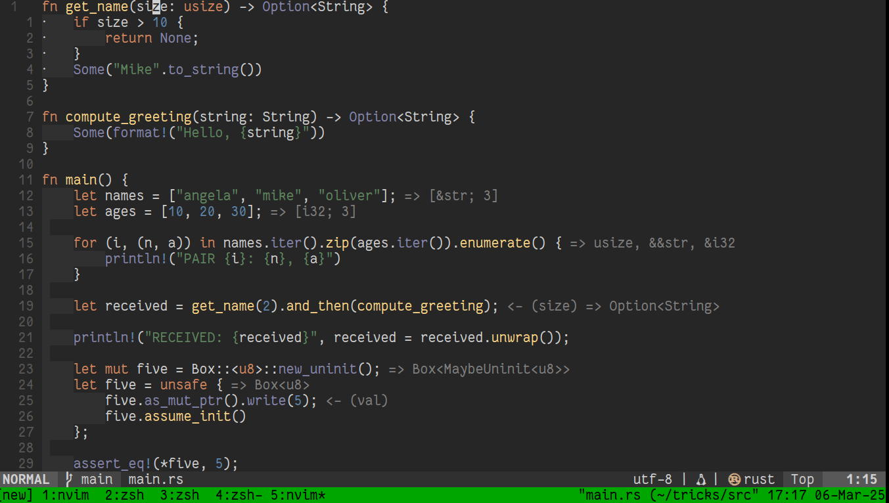

# My Neovim Set-Up 


## Install neovim

[neovim](https://neovim.io/)

## Install Nerd Font

[Nerd Font](https://www.nerdfonts.com/font-downloads)

## Wakatime

Get [Wakatime Api Key](https://wakatime.com)

## Setting up Typescript and Javascript

```bash
npm install -g prettier eslint eslint_d
npm install -g typescript
npm install -g typescript-language-server
```

## License

The project is licensed under the [MIT license](LICENSE)
